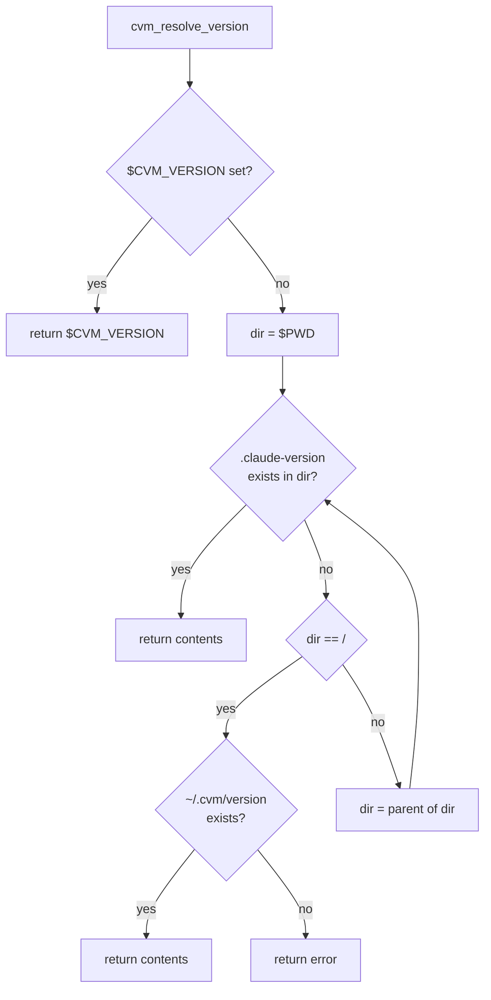
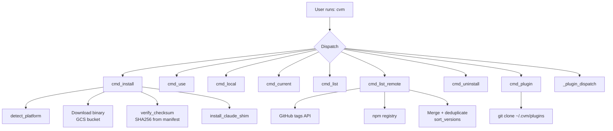

# CVM — Claude Code Version Manager

Install, manage, and switch between versions of the [Claude Code](https://claude.ai/claude-code) CLI. Inspired by `rbenv`, `tfenv`, and `rustup`.

```
cvm install latest        # install the latest version
cvm use 2.1.58            # switch globally
cvm local 2.1.71          # pin a project directory
```

---

## Table of Contents

- [Installation](#installation)
- [Shell Setup](#shell-setup)
- [Quick Start](#quick-start)
- [Commands](#commands)
- [Version Resolution](#version-resolution)
- [Architecture](#architecture)
- [Supported Platforms](#supported-platforms)
- [Requirements](#requirements)
- [Documentation](#documentation)
- [Development](#development)

---

## Installation

### macOS / Linux / WSL / Git Bash

```bash
curl -fsSL https://raw.githubusercontent.com/alexandernicholson/cvm/main/install.sh | bash
```

The installer downloads CVM to `~/.cvm/bin/cvm`, detects your shell, and offers to add the PATH line to your config automatically.

### Windows (native PowerShell)

```powershell
irm https://raw.githubusercontent.com/alexandernicholson/cvm/main/install.ps1 | iex
```

This downloads `cvm.ps1` to `~\.cvm\bin\`, creates a `cvm.cmd` wrapper so `cvm` works from both PowerShell and CMD, and adds `~\.cvm\bin` to your user PATH.

### Manual installation (bash)

```bash
mkdir -p ~/.cvm/bin
curl -fsSL https://raw.githubusercontent.com/alexandernicholson/cvm/main/cvm.sh \
  -o ~/.cvm/bin/cvm
chmod +x ~/.cvm/bin/cvm
```

---

## Shell Setup

Add `~/.cvm/bin` (or `%USERPROFILE%\.cvm\bin` on Windows) to your PATH. Run `cvm env` to print the correct line for your shell:

```bash
cvm env           # auto-detects your shell
cvm env --bash    # force bash syntax
cvm env --zsh     # force zsh syntax
cvm env --fish    # force fish syntax
cvm env --pwsh    # force PowerShell syntax
```

| Shell | Config file | Line to add |
|---|---|---|
| bash | `~/.bashrc` | `export PATH="$HOME/.cvm/bin:$PATH"` |
| zsh | `~/.zshrc` | `export PATH="$HOME/.cvm/bin:$PATH"` |
| fish | `~/.config/fish/config.fish` | `fish_add_path $HOME/.cvm/bin` |
| PowerShell | `$PROFILE` | `$env:PATH = "$env:USERPROFILE\.cvm\bin;$env:PATH"` |

After adding the line, reload your shell (`source ~/.zshrc` or open a new terminal).

---

## Quick Start

```bash
# Install the latest version
cvm install latest

# Verify it works
claude --version

# See installed versions
cvm ls

# Browse all available versions
cvm ls-remote --all
```

---

## Commands

| Command | Description |
|---|---|
| `cvm install <version>` | Install a version (`latest`, `stable`, or semver e.g. `2.1.71`) |
| `cvm use <version>` | Set the global active version |
| `cvm local <version>` | Pin the current directory (writes `.claude-version`) |
| `cvm current` | Show the currently resolved version |
| `cvm which` | Print the full path to the active `claude` binary |
| `cvm ls` | List installed versions |
| `cvm ls-remote [--all]` | List versions available for download |
| `cvm uninstall <version>` | Remove an installed version |
| `cvm plugin <install\|list\|update\|uninstall>` | Manage cvm plugins |
| `cvm env [--bash\|--zsh\|--fish]` | Print the PATH setup line for your shell |
| `cvm self-update` | Update CVM itself to the latest version |
| `cvm self-uninstall` | Remove CVM and all installed Claude Code versions |

Plugins can also register their own subcommands — for example, after installing
the [cvp](https://github.com/alexandernicholson/cvp) profile manager you get
`cvm profile use <name>` to switch gateway/keys per-directory or globally.

### Install channels

```bash
cvm install latest     # most recent release
cvm install stable     # last designated stable release
cvm install 2.1.71     # exact version
cvm install v2.1.71    # leading 'v' is stripped automatically
```

### Per-project versions

```bash
cd my-project
cvm local 2.1.58       # writes .claude-version in this directory
```

Commit `.claude-version` to keep your whole team on the same version. Override for a single command:

```bash
CVM_VERSION=2.1.55 claude --version
```

---

## Version Resolution

CVM resolves the active version in this order:

```
$CVM_VERSION env var        (highest priority)
    ↓
.claude-version file        (walks up from $PWD to /)
    ↓
~/.cvm/version              (global default, set by cvm use)
    ↓
error: no version active
```



---

## Plugins

CVM can install plugins — git repos that register new `cvm <command> ...`
subcommands. Plugins live in `~/.cvm/plugins/<name>/` and ship a `plugin.sh`
that declares `CVM_PLUGIN_COMMAND` and a `cvm_plugin_main()` handler.

```bash
cvm plugin install alexandernicholson/cvp   # install the profile manager
cvm plugin list
cvm profile use work                        # subcommand registered by cvp
cvm plugin uninstall cvp
```

### Env hooks

The active `claude` on your PATH is a bash wrapper (on macOS/Linux). Before
exec'ing the real versioned binary it sources every `~/.cvm/env.d/*.sh`, so
plugins can inject environment variables (e.g. `ANTHROPIC_BASE_URL`,
`CLAUDE_CODE_OAUTH_TOKEN`, feature flags) into every `claude` invocation. The
[cvp](https://github.com/alexandernicholson/cvp) profile plugin uses this hook to
switch profiles per-directory or globally without losing any saved keys/URLs.

> Windows native (PowerShell/`cvm.ps1`) keeps the legacy symlink model; the
> env-hook wrapper is bash/Git-Bash only.

---

## Architecture

CVM is a single bash script with no runtime dependencies beyond `bash`, `curl`, and either `python3` or `jq`. It uses the shim/wrapper model from `tfenv` and `rbenv`: `~/.cvm/bin/claude` is a generated wrapper that resolves the active version and sources env hooks before exec'ing the real binary.



### Directory layout

```
~/.cvm/
├── bin/
│   ├── cvm             ← CVM script itself
│   └── claude          ← wrapper: resolves version, sources env.d/*.sh, execs binary
├── versions/
│   ├── 2.1.58/
│   │   └── claude      ← downloaded native binary
│   └── 2.1.71/
│       └── claude
├── plugins/            ← installed plugins (one dir per plugin, with plugin.sh)
├── env.d/              ← env hooks sourced by the claude wrapper (*.sh)
├── version             ← global default (plain text, e.g. "2.1.71")
└── cache/              ← temporary download staging (cleaned after install)
```

Only `~/.cvm/bin` needs to be on `$PATH`.

### Version listing: dual-source strategy

`cvm ls-remote` fetches from **GitHub tags** and the **npm registry** independently, then merges and deduplicates the results. If one source is rate-limited or down, the other covers it. Only if both are unreachable does the command fail.

### Binary distribution

Claude Code native binaries are served by Anthropic from a GCS bucket. CVM downloads the binary for your platform, verifies its SHA256 checksum against the release manifest, then moves it to `~/.cvm/versions/<version>/claude`. A failed checksum leaves no partial install.

---

## Supported Platforms

| Platform | OS | Architecture |
|---|---|---|
| `darwin-arm64` | macOS | Apple Silicon (M-series) |
| `darwin-x64` | macOS | Intel |
| `linux-arm64` | Linux (glibc) | ARM64 |
| `linux-x64` | Linux (glibc) | x86_64 |
| `linux-arm64-musl` | Linux (musl/Alpine) | ARM64 |
| `linux-x64-musl` | Linux (musl/Alpine) | x86_64 |
| `win32-x64` | Windows (Git Bash/PowerShell) | x86_64 |

CVM auto-detects your platform, including Rosetta 2 on Apple Silicon Macs, musl on Alpine Linux, and MINGW64/MSYS2/Cygwin on Windows.

> **WSL users**: Use the standard Linux install above. WSL runs a real Linux environment, so `linux-x64` binaries work correctly.

---

## Requirements

- **bash** 4.0 or later (macOS ships bash 3.2; install a newer version via Homebrew: `brew install bash`)
- **curl**
- **python3** or **jq** (for JSON parsing in `ls-remote` and checksum extraction; `python3` is usually pre-installed)

---

## Documentation

Full documentation lives in [`docs/`](docs/):

- **[User Guide](docs/user-guide.md)** — installation, shell setup, all commands, per-project versions, troubleshooting
- **[Technical Reference](docs/technical.md)** — architecture, distribution infrastructure, version resolution algorithm, platform detection, testing

---

## Development

```bash
make test           # run all 206 tests
make test-verbose   # TAP output
make lint           # bash -n syntax check
make install-bats   # install bats-core (via Homebrew or npm)
```

Tests use [bats-core](https://github.com/bats-core/bats-core) with a mock `curl` that intercepts all HTTP calls. Each test runs in an isolated `$CVM_DIR` and never touches `~/.cvm` or the real filesystem.

### Test suite overview

| File | Tests | Coverage |
|---|---|---|
| `00-help.bats` | 12 | help, version, unknown commands |
| `01-version-resolution.bats` | 11 | env var, walk-up, global default |
| `02-install.bats` | 17 | install, channels, checksums, env-hook wrapper |
| `03-use.bats` | 10 | global switching, wrapper exec |
| `04-local.bats` | 9 | per-directory `.claude-version` |
| `05-current-which.bats` | 12 | current/which resolution |
| `06-list.bats` | 22 | ls, ls-remote, dual-source resilience |
| `07-uninstall.bats` | 12 | removal, active version handling |
| `08-edge-cases.bats` | 17 | self-update, self-uninstall, idempotency |
| `09-shells.bats` | 51 | bash/zsh/fish compatibility |
| `10-windows.bats` | 12 | Windows platform detection, `.exe` binary, win32-x64 paths |
| `11-shim.bats` | 7 | `claude` wrapper: version resolution + env.d hooks |
| `12-plugin.bats` | 14 | plugin manager: install/list/update/uninstall + dispatch |

### Contributing

1. Fork and clone the repo
2. Make changes to `cvm.sh` or `install.sh`
3. Run `make test` — all 206 tests must pass
4. Open a pull request

---

## Uninstalling CVM

```bash
cvm self-uninstall
# then remove the PATH line from your shell config file
```
