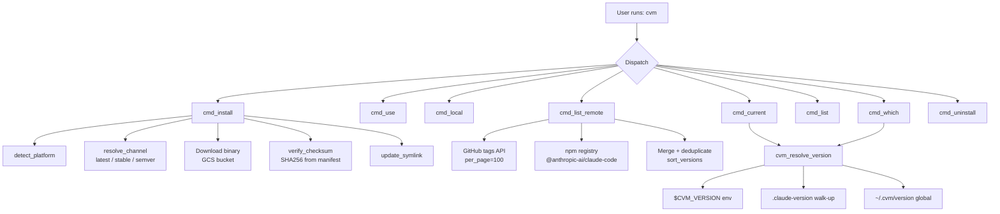
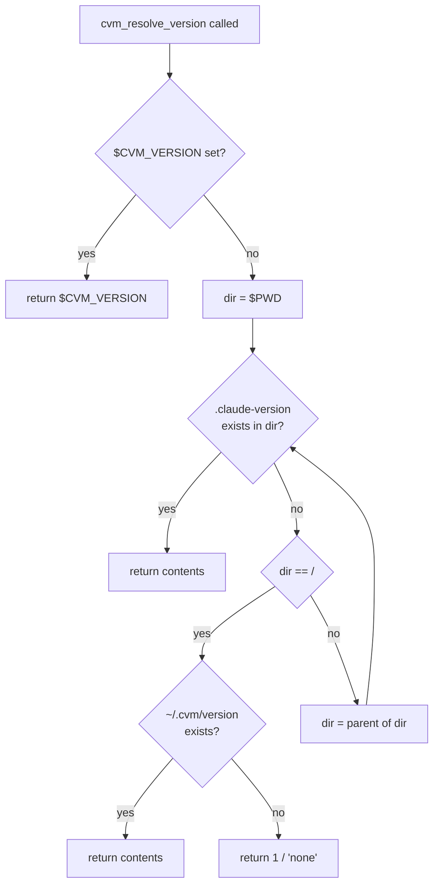
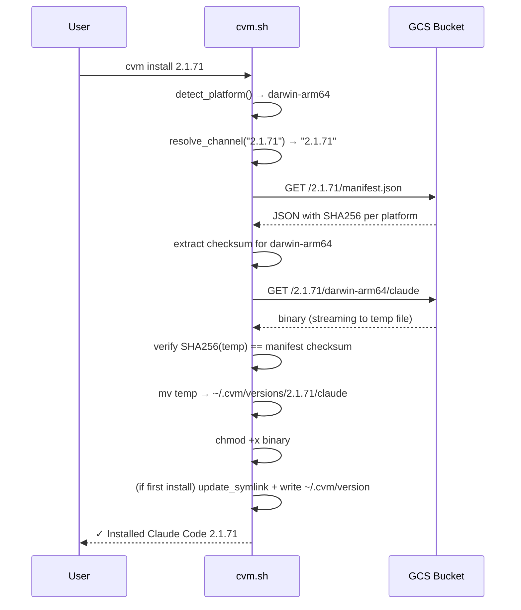
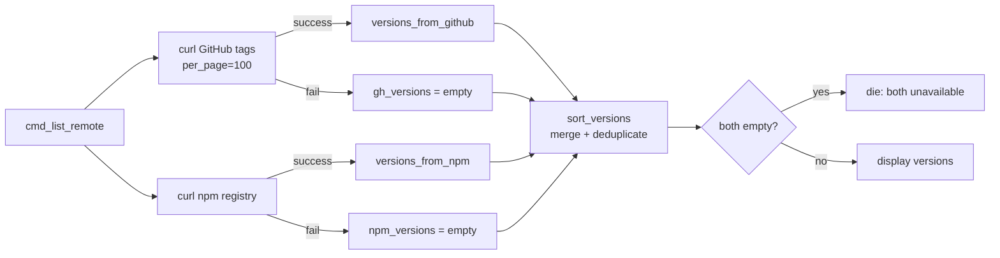
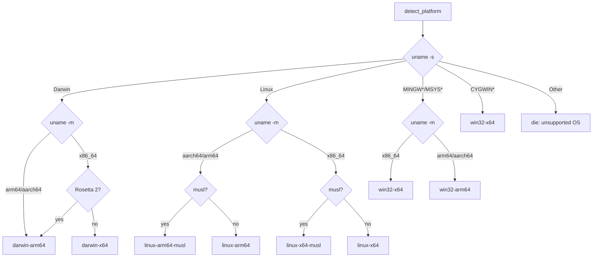

# CVM Technical Reference

This document describes CVM's internal architecture, distribution infrastructure, and contribution guidelines.

---

## Table of Contents

- [Architecture Overview](#architecture-overview)
- [Directory Layout](#directory-layout)
- [Version Resolution Algorithm](#version-resolution-algorithm)
- [Distribution Infrastructure](#distribution-infrastructure)
- [Install Flow](#install-flow)
- [Shell Integration](#shell-integration)
- [Version Listing: Dual-Source Strategy](#version-listing-dual-source-strategy)
- [Platform Detection](#platform-detection)
- [Checksum Verification](#checksum-verification)
- [JSON Parsing](#json-parsing)
- [Testing](#testing)
- [Contributing](#contributing)

---

## Architecture Overview



CVM is a single bash script (`cvm.sh`) with no runtime dependencies beyond `bash`, `curl`, and either `python3` or `jq` (for JSON parsing). It follows the symlink-switching model used by `tfenv` and `rustup`.

---

## Directory Layout

```
~/.cvm/
├── bin/
│   ├── cvm             ← CVM script itself
│   └── claude          ← wrapper: resolves version, sources env.d/*.sh, execs binary
├── versions/
│   ├── 2.1.58/
│   │   └── claude      ← downloaded native binary
│   └── 2.1.71/
│       └── claude
├── plugins/            ← installed plugins (one dir per plugin, with plugin.sh)
├── env.d/              ← env hooks sourced by the claude wrapper (*.sh)
├── version             ← global default (plain text, e.g. "2.1.71")
└── cache/              ← temporary download staging (cleaned after install)
```

The `~/.cvm/bin` directory is the only directory that needs to be on `$PATH`. The `claude` entry in it is a generated bash wrapper (`install_claude_shim` / `_write_claude_wrapper`) that resolves the active version (same order as `cvm_resolve_version`), sources every `~/.cvm/env.d/*.sh`, then `exec`s the real versioned binary. On win32 the legacy symlink/copy is kept (the env-hook wrapper is bash/Git-Bash only; native PowerShell users go through `cvm.ps1`).

---

## Plugin Manager & Env Hooks

**Plugins** live in `~/.cvm/plugins/<name>/` and ship a `plugin.sh` that sets:

```bash
CVM_PLUGIN_NAME="cvp"
CVM_PLUGIN_COMMAND="profile"      # the subcommand this plugin registers
CVM_PLUGIN_VERSION="0.1.0"
CVM_PLUGIN_DESCRIPION="…"
cvm_plugin_main() { … "$@"; }     # invoked with args after the subcommand
```

`cvm plugin install <owner/repo|url>` does a `git clone --depth 1` into
`~/.cvm/plugins/<name>/`. Dispatch (`_plugin_dispatch`) runs when `main()`
receives a non-core command: it scans plugin dirs, sources each `plugin.sh` in a
throwaway subshell to read `CVM_PLUGIN_COMMAND`, and on a match runs
`cvm_plugin_main` in a subshell that inherits CVM's helper functions
(`err`/`info`/`ok`/`warn`/`die`) but is otherwise isolated. A plugin's
non-zero exit code is captured via `(...) || rc=$?` (to defeat `errexit`) and
propagated through the `_CVM_PLUGIN_RC` global.

**Env hooks**: because the `claude` wrapper sources `~/.cvm/env.d/*.sh` before
`exec`, a plugin can drop a resolver script there to inject environment
variables per invocation. The `cvp` profile plugin installs
`~/.cvm/env.d/cvp.sh`, which resolves the active profile (`$CVM_PROFILE` →
`.claude-profile` walk-up → `~/.cvm/active-profile`) and `export`s that
profile's variables — so per-directory profiles take effect at runtime with no
shell reload, and switching the global alias never touches the stored profile
files.

---

## Version Resolution Algorithm



The walk-up traverses from `$PWD` to `/`. This means a `.claude-version` anywhere in the path ancestry takes effect. The `$CVM_VERSION` environment variable always wins, making it easy to override for a single command:

```bash
CVM_VERSION=2.1.55 claude --version
```

---

## Distribution Infrastructure

Claude Code is distributed by Anthropic through a GCS (Google Cloud Storage) bucket:

```
Base: https://storage.googleapis.com/claude-code-dist-86c565f3-f756-42ad-8dfa-d59b1c096819/claude-code-releases
```

| Path | Contents |
|---|---|
| `{BASE}/latest` | Plain-text version string for the latest channel |
| `{BASE}/stable` | Plain-text version string for the stable channel |
| `{BASE}/{VERSION}/manifest.json` | JSON with SHA256 checksums per platform |
| `{BASE}/{VERSION}/{PLATFORM}/claude` | Native binary |

### Supported platforms

| Platform key | OS | Architecture |
|---|---|---|
| `darwin-arm64` | macOS | Apple Silicon (M-series) |
| `darwin-x64` | macOS | Intel |
| `linux-arm64` | Linux (glibc) | ARM64 |
| `linux-x64` | Linux (glibc) | x86_64 |
| `linux-arm64-musl` | Linux (musl/Alpine) | ARM64 |
| `linux-x64-musl` | Linux (musl/Alpine) | x86_64 |
| `win32-x64` | Windows (Git Bash/PowerShell) | x86_64 |

### Manifest format

```json
{
  "version": "2.1.71",
  "buildDate": "2026-03-06T22:51:07Z",
  "platforms": {
    "darwin-arm64": {
      "binary": "claude",
      "checksum": "f3d8129ec7ddaf158c10e193df546421499d69b7f44ec2f0b67c3fe54f601cb9",
      "size": 192377712
    }
  }
}
```

---

## Install Flow



Downloads are staged to `~/.cvm/cache/` and only moved to `~/.cvm/versions/` after checksum verification passes. A failed download or checksum mismatch leaves no partial install.

---

## Shell Integration

CVM requires only `~/.cvm/bin` to be on `$PATH`. No shell hooks, `eval` blocks, or function sourcing are needed for global version switching.

Per-directory switching (`cvm local`) works because the `cvm_resolve_version` function is called by `cmd_current` and `cmd_which`, and the `claude` symlink always points to the active global version. For per-project versions, the `claude` wrapper in `~/.cvm/bin` is the actual binary (via symlink) — it does not do version resolution at runtime.

> **Note**: If you need per-directory versions to take effect automatically when `claude` is invoked directly (without going through `cvm which`), you need a shell wrapper function or hook. This is not implemented in the current symlink model.

### Shell-specific PATH setup

| Shell | Config file | Setup line |
|---|---|---|
| bash | `~/.bashrc` | `export PATH="$HOME/.cvm/bin:$PATH"` |
| zsh | `~/.zshrc` | `export PATH="$HOME/.cvm/bin:$PATH"` |
| fish | `~/.config/fish/config.fish` | `fish_add_path $HOME/.cvm/bin` |

`cvm env [--bash\|--zsh\|--fish]` outputs the correct line. When no flag is given, the shell is detected from `$SHELL`.

---

## Version Listing: Dual-Source Strategy

`cvm ls-remote` fetches from two independent sources and merges results:



This means:
- If GitHub's API is rate-limited or down → npm covers it
- If npm is deprecated/removed → GitHub covers it
- If both are down → a clear error is shown

Version numbers are deduplicated and sorted as semver using Python (preferred) or `sort -u` (fallback).

---

## Platform Detection



**Rosetta 2 detection**: On macOS, if `uname -m` reports `x86_64` but `sysctl machdep.cpu.brand_string` contains "Apple", the machine is an M-series Mac running under Rosetta. CVM downloads the `darwin-arm64` binary in this case (matching the official `bootstrap.sh` behaviour).

**musl detection**: Checks whether `/bin/sh`'s dynamic linker string contains "musl" via `ldd /bin/sh`.

**Windows detection**: `uname -s` in Git Bash returns `MINGW64_NT-*` or `MSYS_NT-*`; Cygwin returns `CYGWIN_NT-*`. CVM maps these to `win32-x64` (or `win32-arm64` on ARM64 Windows). The binary is named `claude.exe` on all `win32-*` platforms. Native PowerShell users should use `cvm.ps1` instead of `cvm.sh`.

---

## Checksum Verification

Every binary download is verified against the SHA256 checksum published in `manifest.json` before being installed:

```bash
# Pseudocode
manifest=$(curl .../VERSION/manifest.json)
checksum=$(extract .platforms[PLATFORM].checksum from manifest)
curl .../VERSION/PLATFORM/claude -o TMPFILE
sha256(TMPFILE) == checksum  || die "Checksum mismatch"
mv TMPFILE ~/.cvm/versions/VERSION/claude
```

If `sha256sum` is not available, `shasum -a 256` is tried. If neither is available, a warning is emitted and verification is skipped. If verification fails, the temp file is deleted and installation aborts — no partial install is left behind.

---

## JSON Parsing

CVM requires JSON parsing for two operations: extracting the checksum from `manifest.json`, and parsing version lists from the GitHub/npm APIs.

It tries parsers in this order:

1. `jq` — preferred, fastest
2. `python3` — universal fallback
3. `python` — older system Python fallback

For `ls-remote`, if no parser is available, CVM exits with an error. For checksum extraction, if no parser is available, verification is skipped with a warning (so install still works on minimal systems).

---

## Testing

The test suite uses [bats-core](https://github.com/bats-core/bats-core).

```bash
make test           # run all tests
make test-verbose   # TAP output
make lint           # bash -n syntax check
make install-bats   # install bats via Homebrew or npm
```

### Structure

```
test/
├── helpers/
│   ├── bin/curl        ← mock curl (intercepts all HTTP calls)
│   └── common.bash     ← setup/teardown, make_fake_version, assert_*
└── bats/
    ├── 00-help.bats             (12 tests)  help, version, unknown commands
    ├── 01-version-resolution.bats (11 tests)  env/walk-up/global chain
    ├── 02-install.bats          (16 tests)  install, channels, checksums
    ├── 03-use.bats              (10 tests)  global switching, symlinks
    ├── 04-local.bats            ( 9 tests)  per-directory .claude-version
    ├── 05-current-which.bats    (15 tests)  current/which commands
    ├── 06-list.bats             (22 tests)  ls, ls-remote, resilience
    ├── 07-uninstall.bats        (13 tests)  uninstall, active version handling
    ├── 08-edge-cases.bats       (14 tests)  self-update, self-uninstall, idempotency
    ├── 09-shells.bats           (51 tests)  bash, zsh, fish compatibility
    └── 10-windows.bats          (12 tests)  Windows platform (MINGW64), claude.exe paths
```

### Mock curl

All HTTP calls are intercepted by `test/helpers/bin/curl`, which is prepended to `$PATH` in each test's `setup()`. It handles:

- GCS latest/stable pointers
- GCS manifest.json (generates correct SHA256 for fake binary)
- GCS binary download (writes a known fake binary)
- GitHub tags API
- npm registry
- GitHub raw (for self-update)

Failure injection is controlled by environment variables:

| Variable | Effect |
|---|---|
| `MOCK_CURL_FAIL=<string>` | Fail any URL containing `<string>` |
| `MOCK_CURL_FAIL_GITHUB=1` | Fail all `api.github.com` calls |
| `MOCK_CURL_FAIL_NPM=1` | Fail all `registry.npmjs.org` calls |

### Test isolation

Each test gets its own `$CVM_DIR` (a `mktemp -d` directory) and `$TEST_WORKDIR`. Both are cleaned up in `teardown()`. No test touches `~/.cvm` or the real filesystem.

---

## Contributing

1. Fork and clone the repo
2. Make changes to `cvm.sh` or `install.sh`
3. Run `make test` — all 185 tests must pass
4. Open a pull request

### Adding a new command

1. Write `cmd_<name>()` in `cvm.sh`
2. Add it to the `main()` dispatch `case` block
3. Document it in `cmd_help()`
4. Add tests in an appropriate `test/bats/*.bats` file
5. Update `docs/user-guide.md`
